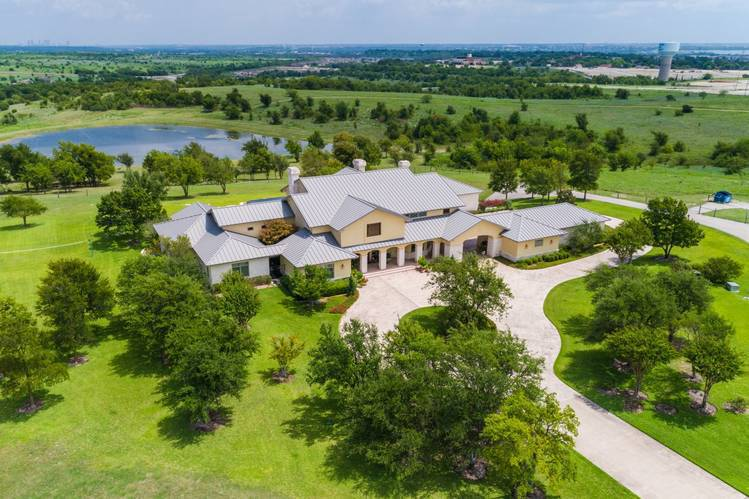

# SolutionPlan_Template

# 1. Your Team at a Glance

## Team Name / Tagline
*TheBigRanch*

## Team Members
| Name                  | GitHub Handle  | Role(s)   |
|-----------------------|----------------|-----------|  
| Bruno de Sousa        | inuterall      | Developer |
| Rodrigo Oliveira      | Rodrigo-Ol     | Developer |
| Catarina Ferreira     | catarinaferrei | Developer |
| Guilherme Barros      | guifreiremag   | Developer |

## Challenge
*Which challenge have you decided to compete for?*

## Core Idea
*What is your rough solution idea?*

*Sketch something that helps understand e.g. mermaid chart*

---

# 2. How Do You Work

## Development Process
*Brief overview of your development process.*

### Planning & Tracking
Use github issues to create tickets, provide an estimated deadline and assign resources.

### Quality Assurance
*How do you ensure quality (e.g., testing, documentation, code reviews)?*

## Communication
We communicate openly, giving everyone the freedom to share their ideas and raise their points. We also occasionally use Slack to share resources and links.

## Decision Making
We make decisions by voting. If a team member disagrees or votes against, we take time to listen to their perspective, understand their reasoning, and then consider as a team whether their point makes sense.
