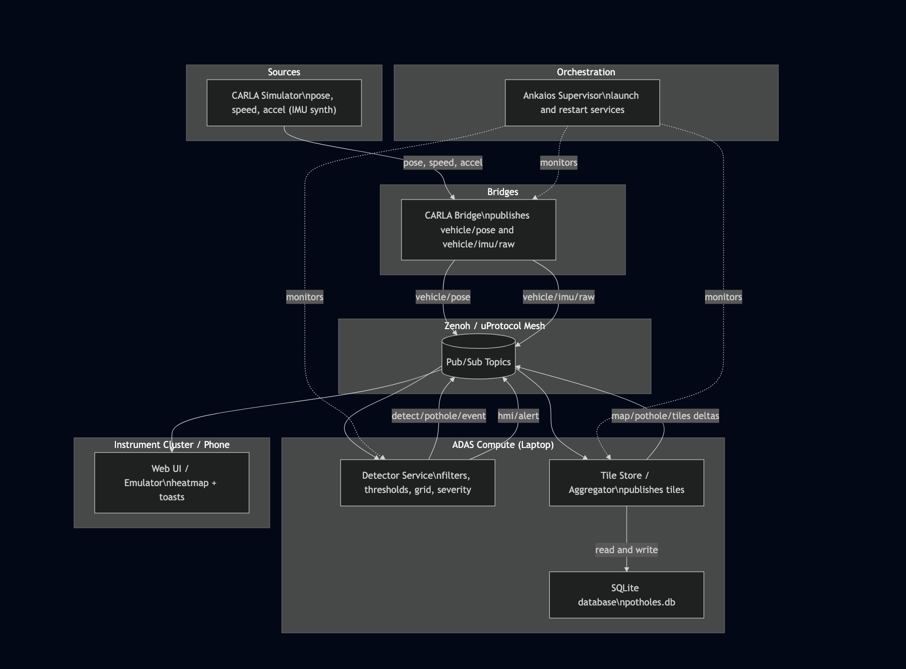

# SolutionPlan_Template

# 1. Your Team at a Glance

## The Big Ranch / The Big Ranch Branch 


## Team Members
| Name                  | GitHub Handle  | Role(s)   |
|-----------------------|----------------|-----------|  
| Bruno de Sousa        | inuterall      | Developer |
| Rodrigo Oliveira      | Rodrigo-Ol     | Developer |
| Catarina Ferreira     | catarinaferrei | Developer |
| Guilherme Barros      | guifreiremag   | Developer |

## Challenge
We have chosen to do the **SDV Lab Challenge**.

## Core Idea

Pothole Map Builder, detect sudden, negative, vertical variations (Potholes)
on the road.


## Data Sources
- **CARLA Simulator**
  - Provides vehicle **pose**, **speed**, and **acceleration** (used as IMU).
  - Pose means the vehicles position and orientation in space at a given time
- **CARLA Bridge**
  - On each CARLA tick, publishes:
    - `vehicle/pose` → `{ ts, x, y, yaw, speed_mps }`
    - `vehicle/imu/raw` → `{ ts, src:"carla", hz, acc:{ x, y, z } }`

## Topic Payloads — Field Explanations

### Topic: `vehicle/pose`
**Payload shape:** `{ ts, x, y, yaw, speed_mps }`

- **`ts`** — Timestamp in seconds since Unix epoch (float). When this pose was produce
- **`x`** — Position on the maps X axis (meters)
- **`y`** — Position on the maps Y axis (meters)
- **`yaw`** — Heading (radians) in the world/map frame. `0` faces right; increases counter-clockwise
  - Yaw is basically just how much the car is turned left or right, `0` being right,
    `3,14 (π)` left, `π/2` up and `3π/2` down
- **`speed_mps`** — Vehicle speed (meters/second). Convert to km/h by `* 3.6`

**Example**
```json
{ "ts": 1712345678.12, 
  "x": 123.45, 
  "y": 67.89,
  "yaw": 1.57, 
  "speed_mps": 12.3 }
```

## Topic: `vehicle/imu/raw`

**Payload shape:** `{ ts, src, hz, acc: { x, y, z } }`

- **`ts`** — Timestamp in seconds since Unix epoch (float). When this IMU sample was produced
- **`src`** — Producer ID string. Use `"carla"` when synthesized from CARLA
- **`hz`** — Sampling rate in Hertz (samples per second)
- **`acc`** — Linear acceleration (m/s²) in the vehicle/body frame:
  - **`acc.x`** — Forward/backward acceleration (forward is +X)
  - **`acc.y`** — Lateral acceleration left/right (left is +Y)
  - **`acc.z`** — Vertical acceleration up/down (up is +Z)

**Example**
```json
{
  "ts": 1712345678.13,
  "src": "carla",
  "hz": 100,
  "acc": { "x": 0.4, "y": -0.2, "z": 9.6 }
}
```


## Transport (Zenoh / uProtocol)
- **Zenoh** is the data bus (low-latency pub/sub + simple queries)
- Producers **put** on keys; consumers **subscribe**

## Processing (ADAS Compute)
- **Advanced Driver-Assistance Systems** 
- **Detector Service**
  - Subscribes to `vehicle/pose` and `vehicle/imu/raw`
  - High-pass filters vertical accel, maintains baseline noise, computes a **score**
  - When thresholds are met, emits `detect/pothole/event` with `{ x, y, cell, severity, score }`
  - Looks ~X m ahead; if a high-confidence cell is on path, publishes `hmi/alert`
- **Tile Store / Aggregator**
  - Subscribes to `detect/pothole/event`
  - **Upserts** grid cells in a local **SQLite** DB (`potholes.db`), updating `hits`, `confidence`, and dominant `severity`
  - Publishes compact deltas (small changes) on `map/pothole/tiles` for the HMI
  so if just a couple of grid cells changed, it publishes a tiny payload

## Storage
- **SQLite database (`potholes.db`)**
  - Durable store for the heatmap grid (and optional raw events)
  - Supports decay/pruning so stale potholes fade over time

## Presentation (HMI)
- **Web/Cluster UI**
  - Subscribes to `map/pothole/tiles` → renders live heatmap
  - Subscribes to `hmi/alert` → shows toast (e.g., “Pothole 24 m — HIGH”) and plays a chime

## Orchestration
- **Ankaios**
  - Starts services in order (Bridge → Detector → Tile Store → HMI gateway)
  - Restarts on crash; exposes simple health status

## End-to-End Sequence
1. CARLA sim hits a bump → Bridge publishes **pose** + **IMU** samples
2. Detector filters & scores → raises **pothole event**
3. Tile Store updates **SQLite** and publishes **tile delta**
4. HMI receives tiles → heatmap updates; if approaching, also receives **alert**

## Key Zenoh Topics (Legend)
- `vehicle/pose`
- `vehicle/imu/raw`
- `detect/pothole/event`
- `map/pothole/tiles`
- `hmi/alert`
---

# 2. How Do You Work

## Development Process
- Early Brainstorm session 
- Define Core Idea
- Ticket creation and refinement (using github issues)
- Feature branch creation
- Pull Request 
- Code Review 

### Planning & Tracking
Use github issues to create tickets, provide an estimated deadline and assign resources.

### Quality Assurance
We will have a pipeline which will include code quality tools. If possible, we will also implement some automated tests for fixed inputs

## Communication
We communicate openly, giving everyone the freedom to share their ideas and raise their points. We also occasionally use Slack to share resources and links.

## Decision Making
We make decisions by voting. If a team member disagrees or votes against, we take time to listen to their perspective, understand their reasoning, and then consider as a team whether their point makes sense.
